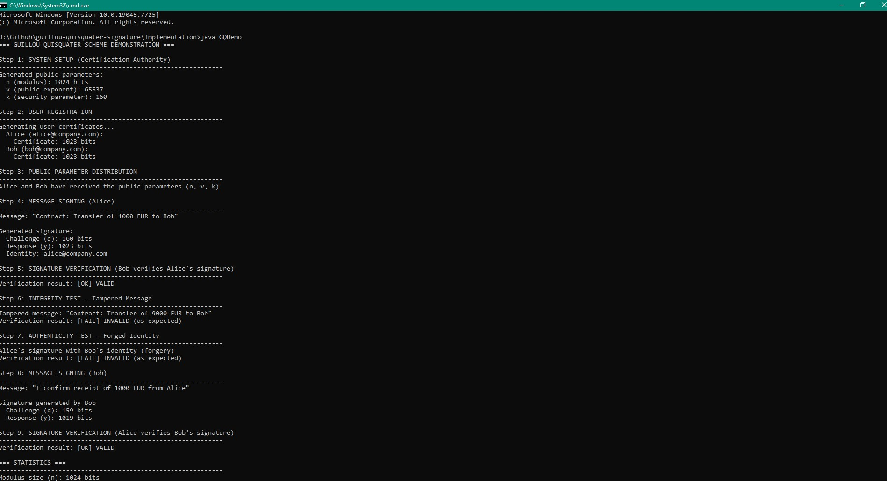
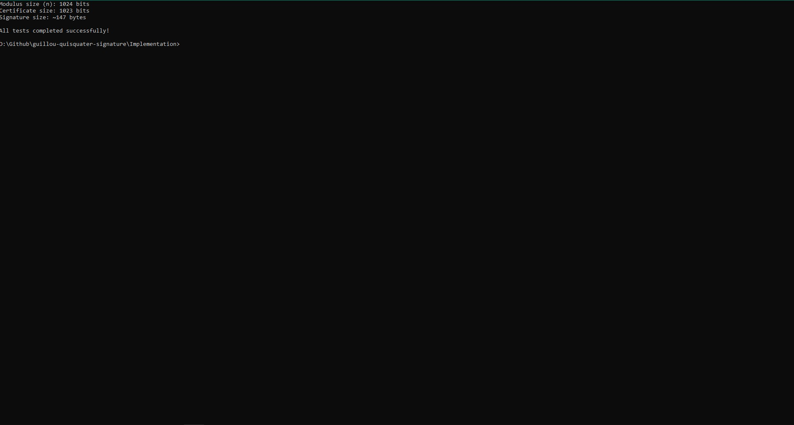
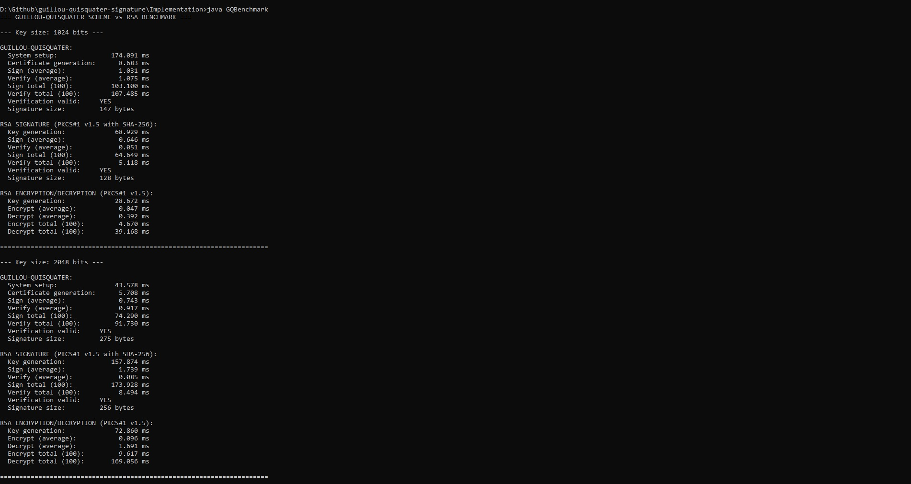
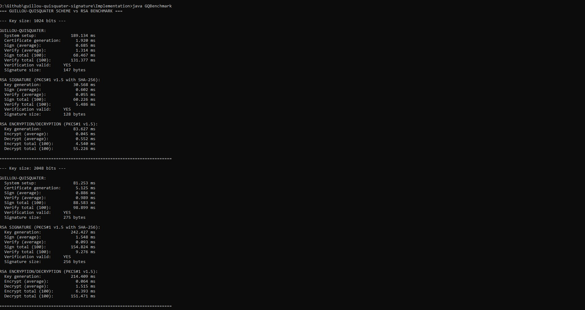

# Guillou - Quisquater Digital Signature in Z\*<sub>n</sub>

Java implementation of the **Guillou–Quisquater** (GQ) identity-based digital signature scheme, together with a demonstration of the protocol and a comparative benchmark against **RSA**.

---

## Table of Contents

1. [Overview](#1-overview)
2. [How the scheme works](#2-how-the-scheme-works)
3. [Repository structure](#3-repository-structure)
4. [File description](#4-file-description)
5. [System requirements](#5-system-requirements)
6. [Quick start](#6-quick-start)
7. [Compilation](#7-compilation)
8. [Running](#8-running)
9. [Expected results](#9-expected-results) — including [captured runs](#c-captured-runs-screenshots)
10. [Code structure](#10-code-structure)
11. [Security notes and limitations](#11-security-notes-and-limitations)
12. [Troubleshooting](#12-troubleshooting)
13. [References](#13-references)
14. [License](#14-license)

---

## 1. Overview

Guillou–Quisquater is an **identity-based** signature scheme whose security rests on the difficulty of extracting `v`-th roots modulo a composite `n = p·q` (the RSA problem). It was introduced by Louis Guillou and Jean-Jacques Quisquater in 1988 as a zero-knowledge _identification_ protocol designed for smart cards, minimizing both transmission and memory; applying the **Fiat–Shamir transform** — replacing the verifier's random challenge with a hash — turns it into a non-interactive _signature_ scheme. That signature scheme is what this repository implements.

**What "identity-based" means here.** A signer's public key is not a random value that must be published and certified — it is simply `I = H(identity)`, derived from a string such as `alice@company.com`. A verifier needs nothing but the signer's identity and the system-wide public parameters `(n, v, k)`: no public-key directory to look up, no certificate chain to validate. The price is a **trusted Certification Authority (CA)**: only the CA knows the factorization of `n`, and it is the CA that issues each user the secret `J = I^s mod n` — the only value that can produce signatures for that identity.

**Why it is interesting.** Compared with RSA it trades a slightly larger signature and a more expensive verification for a much smaller key-management burden, and its signing and verification costs barely grow when the modulus doubles from 1024 to 2048 bits (see the [benchmark](#b-when-running-gqbenchmark)). It is also a textbook example of the Σ-protocol → signature construction that underlies Schnorr, DSA and Ed25519.

---

## 2. How the scheme works

### Notation

| Symbol   | Meaning                                                     | Who knows it                 |
| -------- | ----------------------------------------------------------- | ---------------------------- |
| `p`, `q` | Random primes of `bitLength/2` bits                         | CA only                      |
| `n`      | Modulus, `n = p·q`                                          | Public                       |
| `φ(n)`   | Euler's totient, `(p−1)(q−1)`                               | CA only                      |
| `v`      | Public exponent, `gcd(v, φ(n)) = 1` (from `65537` upward)   | Public                       |
| `s`      | Private exponent, `s·v ≡ 1 (mod φ(n))`                      | CA only                      |
| `k`      | Security parameter — bit length of the challenge (160 here) | Public                       |
| `I`      | Signer's public identity value, `I = H(identity) mod n`     | Public (derivable by anyone) |
| `J`      | Signer's private certificate, `J = I^s mod n`               | Signer only                  |
| `r`      | Fresh random nonce in `Z*`<sub>n</sub>, one per signature   | Signer only, never reused    |
| `T`      | Commitment, `T = r^v mod n`                                 | Intermediate value           |
| `d`      | Challenge, `d = H(M ‖ T) mod 2^k`                           | Part of the signature        |
| `y`      | Response, `y = r·J^d mod n`                                 | Part of the signature        |

### The four operations

**1. Setup** _(CA, once for the whole system)_

```text
p, q  <- random primes of bitLength/2 bits
n     <- p * q
phi   <- (p-1)(q-1)
v     <- smallest odd integer >= 65537 with gcd(v, phi) = 1
s     <- v^(-1) mod phi
publish (n, v, k) ; keep (p, q, phi, s) secret
```

**2. Certificate extraction** _(CA, once per user)_

```text
I <- H(identity) mod n
J <- I^s mod n          -> delivered privately to the user
```

`J` is a `v`-th root of `I` modulo `n`. Computing it requires `s`, hence the factorization of `n` — which is why only the CA can issue certificates.

**3. Signing** _(signer, for message `M`)_

```text
r <- random in Z*n            (fresh for every signature)
T <- r^v mod n                (commitment)
d <- H(M || T) mod 2^k        (challenge - Fiat-Shamir)
y <- r * J^d mod n            (response)
signature = (d, y, identity)
```

**4. Verification** _(anyone, from the identity alone)_

```text
I  <- H(identity) mod n
T' <- y^v * I^(-d) mod n      (recover the commitment)
d' <- H(M || T') mod 2^k
accept iff d' == d
```

### Why verification works

The verifier never receives `T`; it _reconstructs_ it. Since `s·v ≡ 1 (mod φ(n))`, Euler's theorem gives `J^v = (I^s)^v = I`. Therefore, for an honestly produced signature:

```text
y^v = (r * J^d)^v = r^v * (J^v)^d = T * I^d   (mod n)
```

so `y^v · I^(−d) ≡ T (mod n)` and the recomputed `T'` equals the signer's `T` exactly. Hashing it together with the same message reproduces the same challenge, so `d' == d` and the signature is accepted.

### Why it is hard to forge

A forger who does not know `J` would have to pick `y` and `d` such that the hash of `M ‖ (y^v·I^(−d))` happens to equal `d`. But `d` is determined by `T` only _after_ `T` is fixed, so the forger cannot commit first and choose the challenge afterwards; the success probability of a guess is about `2^(−k)` — with `k = 160`, negligible. Producing `J` directly means extracting a `v`-th root modulo `n`, i.e. solving the RSA problem. Changing a single bit of the message changes `d'`, and substituting a different identity changes `I` and therefore `T'` — both cases are run as negative tests in `GQDemo` (steps 6 and 7).

### Signature size

A GQ signature carries `d` (`k` bits) and `y` (up to `|n|` bits), i.e. **`k + |n|` bits** — about 148 bytes for a 1024-bit modulus and 276 bytes for 2048 bits, versus exactly `|n|` bits (128 / 256 bytes) for RSA. That overhead is the price of not needing a public-key certificate alongside the signature.

---

## 3. Repository structure

```text
guillou-quisquater-signature/
├── Docs/
│   ├── GQ_Presentation.pdf      # project presentation slides
│   └── GQ_Report_IEEE.pdf       # the IEEE-format paper
├── Implementation/
│   ├── GQSignature.java         # the scheme itself
│   ├── GQDemo.java              # runnable protocol demonstration
│   └── GQBenchmark.java         # GQ vs RSA performance comparison
├── Tests/
│   ├── GQDemo_1.jpg             # demo run, steps 1-9
│   ├── GQDemo_2.jpg             # demo run, final statistics
│   ├── GQBenchmark_1.jpg        # benchmark, run 1 of 3
│   ├── GQBenchmark_2.jpg        # benchmark, run 2 of 3
│   └── GQBenchmark_3.jpg        # benchmark, run 3 of 3
├── .gitignore
└── README.md
```

The implementation has **no external dependencies** — only the Java standard library (`java.math.BigInteger`, `java.security.MessageDigest`, `java.security.SecureRandom`, plus `java.security.Signature` and `javax.crypto.Cipher` for the RSA baseline). There is no build tool: `javac` alone is enough.

---

## 4. File description

The project contains **3 Java source files** in the [`Implementation/`](Implementation/) directory:

| File                                                  | Role                                                                                                 |
| ----------------------------------------------------- | ---------------------------------------------------------------------------------------------------- |
| [`GQSignature.java`](Implementation/GQSignature.java) | Main implementation of the GQ algorithm (parameter generation, certification, signing, verification) |
| [`GQDemo.java`](Implementation/GQDemo.java)           | Complete demonstration with two users (Alice and Bob). Includes integrity and authenticity tests     |
| [`GQBenchmark.java`](Implementation/GQBenchmark.java) | Comparative performance measurements **GQ vs RSA**. Tests 1024- and 2048-bit keys                    |

In addition, the project documentation is located in [`Docs/`](Docs/):

| File                                              | Content                                            |
| ------------------------------------------------- | -------------------------------------------------- |
| [`GQ_Report_IEEE.pdf`](Docs/GQ_Report_IEEE.pdf)   | The full paper in IEEE format (theory and results) |
| [`GQ_Presentation.pdf`](Docs/GQ_Presentation.pdf) | Presentation slides for the project                |

Finally, [`Tests/`](Tests/) holds screenshots of actual runs on Windows 10 — captured evidence that the programs behave as this README describes. They are displayed and discussed in [Captured runs](#c-captured-runs-screenshots).

| File                                                  | Content                                                        |
| ----------------------------------------------------- | -------------------------------------------------------------- |
| [`GQDemo_1.jpg`](Tests/GQDemo_1.jpg)                  | `GQDemo` — steps 1 through 9, including the two negative tests |
| [`GQDemo_2.jpg`](Tests/GQDemo_2.jpg)                  | `GQDemo` — the closing statistics block                        |
| [`GQBenchmark_1.jpg`](Tests/GQBenchmark_1.jpg)        | `GQBenchmark` — complete run 1 (1024 and 2048 bits)            |
| [`GQBenchmark_2.jpg`](Tests/GQBenchmark_2.jpg)        | `GQBenchmark` — complete run 2, same machine                   |
| [`GQBenchmark_3.jpg`](Tests/GQBenchmark_3.jpg)        | `GQBenchmark` — complete run 3, same machine                   |

---

## 5. System requirements

- **Java Development Kit (JDK) version 11 or newer**
  _(the code uses `String.repeat()` and `BigInteger.TWO`, which are not available in Java 8)_

Check the version:

```bash
java -version
javac -version
```

If `javac` is not available, install the full JDK:

| System                | Installation                                                  |
| --------------------- | ------------------------------------------------------------- |
| Windows               | Download from [adoptium.net](https://adoptium.net/) or Oracle |
| Linux (Ubuntu/Debian) | `sudo apt install default-jdk`                                |
| macOS                 | `brew install openjdk`                                        |

---

## 6. Quick start

```bash
git clone https://github.com/flavia-martinecz/schema-semnatura-digitala-Guillou-Quisquater.git
cd schema-semnatura-digitala-Guillou-Quisquater/Implementation
javac -encoding UTF-8 *.java
java GQDemo        # the protocol, step by step
java GQBenchmark   # GQ vs RSA timings (takes a few seconds)
```

To keep the compiled classes out of the source folder, compile from the repository root into a separate directory instead:

```bash
javac -encoding UTF-8 -d out Implementation/*.java
java -cp out GQDemo
```

---

## 7. Compilation

Open a terminal in the [`Implementation/`](Implementation/) directory and run:

```bash
javac -encoding UTF-8 *.java
```

After compilation, the following `.class` files will appear:

- `GQSignature.class`
- `GQSignature$GQSignatureData.class` _(inner class holding the signature data)_
- `GQDemo.class`
- `GQBenchmark.class`

> **Note:** The `.class` files are excluded from the repository via [`.gitignore`](.gitignore).

---

## 8. Running

### A) Functionality demonstration

```bash
java GQDemo
```

The demo uses a **1024-bit** modulus and a **160-bit** security parameter `k`. It goes through 9 steps:

1. System parameter generation by the Certification Authority (`n`, `v`, `k`)
2. Registration of users Alice and Bob (certificate generation)
3. Distribution of the public parameters to the users
4. Alice signs a message
5. Bob verifies Alice's signature (must be **VALID**)
6. Integrity test with a tampered message (must be **INVALID**)
7. Authenticity test with a forged identity (must be **INVALID**)
8. Bob signs his own message
9. Alice verifies Bob's signature (must be **VALID**)

Finally, statistics about the modulus, certificate and signature sizes are printed.

> Steps 6 and 7 are the interesting ones: they are _supposed_ to fail. Step 6 shows that changing a digit in the message breaks the binding `d = H(M ‖ T)`; step 7 shows that a signature cannot be relabelled with someone else's identity, because the verifier derives `I` from that identity and would reconstruct a different `T'`.

To experiment, edit the two constants at the top of `GQDemo.main` — `bitLength` (try `512` for a faster run, `2048` for a slower one) and `securityParam` — then recompile.

### B) Benchmark — GQ vs RSA performance comparison

```bash
java GQBenchmark
```

For each key size (**1024** and **2048** bits) it measures, after a JVM warmup, the average and total time over **100 iterations** for:

- **GQ**: system setup, certificate generation, signing, verification
- **RSA Signature** (`SHA256withRSA`, PKCS#1 v1.5): key generation, signing, verification
- **RSA Encryption/Decryption** (`RSA/ECB/PKCS1Padding`): key generation, encryption, decryption

All output uses plain ASCII, so it renders correctly in any terminal (including Windows `cmd`).

> Key generation (GQ setup and the RSA `KeyPairGenerator`) is reported from a **single** run rather than averaged, because it is dominated by random prime search and therefore varies widely between runs. Only the per-operation figures — sign, verify, encrypt, decrypt — are averaged over the 100 iterations.

---

## 9. Expected results

### A) When running `GQDemo`

Real output from one run (Windows 10, JDK 25):

```text
=== GUILLOU-QUISQUATER SCHEME DEMONSTRATION ===

Step 1: SYSTEM SETUP (Certification Authority)
------------------------------------------------------------
Generated public parameters:
  n (modulus): 1023 bits
  v (public exponent): 65537
  k (security parameter): 160

Step 2: USER REGISTRATION
------------------------------------------------------------
Generating user certificates...
  Alice (alice@company.com):
    Certificate: 1022 bits
  Bob (bob@company.com):
    Certificate: 1021 bits

Step 3: PUBLIC PARAMETER DISTRIBUTION
------------------------------------------------------------
Alice and Bob have received the public parameters (n, v, k)

Step 4: MESSAGE SIGNING (Alice)
------------------------------------------------------------
Message: "Contract: Transfer of 1000 EUR to Bob"

Generated signature:
  Challenge (d): 156 bits
  Response (y): 1023 bits
  Identity: alice@company.com

Step 5: SIGNATURE VERIFICATION (Bob verifies Alice's signature)
------------------------------------------------------------
Verification result: [OK] VALID

Step 6: INTEGRITY TEST - Tampered Message
------------------------------------------------------------
Tampered message: "Contract: Transfer of 9000 EUR to Bob"
Verification result: [FAIL] INVALID (as expected)

Step 7: AUTHENTICITY TEST - Forged Identity
------------------------------------------------------------
Alice's signature with Bob's identity (forgery)
Verification result: [FAIL] INVALID (as expected)

Step 8: MESSAGE SIGNING (Bob)
------------------------------------------------------------
Message: "I confirm receipt of 1000 EUR from Alice"

Signature generated by Bob
  Challenge (d): 160 bits
  Response (y): 1023 bits

Step 9: SIGNATURE VERIFICATION (Alice verifies Bob's signature)
------------------------------------------------------------
Verification result: [OK] VALID

=== STATISTICS ===
------------------------------------------------------------
Modulus size (n): 1024 bits
Certificate size: 1022 bits
Signature size: ~147 bytes

All tests completed successfully!
```

> The exact bit lengths of `n`, the certificates and `y` may vary by a bit or two between runs, because the primes `p` and `q` are generated randomly. The same applies to `d`: it is reduced modulo `2^160`, so it is _at most_ 160 bits, and a shorter value (156 in the run above) simply means the top hash bits happened to be zero. The verification results (VALID / INVALID / INVALID / VALID) are always the same.

### B) When running `GQBenchmark`

Real output from one run (Windows 10, JDK 25; timings vary by machine and between runs):

```text
=== GUILLOU-QUISQUATER SCHEME vs RSA BENCHMARK ===

--- Key size: 1024 bits ---

GUILLOU-QUISQUATER:
  System setup:              240.000 ms
  Certificate generation:      2.765 ms
  Sign (average):              1.373 ms
  Verify (average):            1.967 ms
  Sign total (100):          137.273 ms
  Verify total (100):        196.718 ms
  Verification valid:     YES
  Signature size:         147 bytes

RSA SIGNATURE (PKCS#1 v1.5 with SHA-256):
  Key generation:             44.103 ms
  Sign (average):              1.011 ms
  Verify (average):            0.100 ms
  Sign total (100):          101.116 ms
  Verify total (100):         10.007 ms
  Verification valid:     YES
  Signature size:         128 bytes

RSA ENCRYPTION/DECRYPTION (PKCS#1 v1.5):
  Key generation:             33.454 ms
  Encrypt (average):           0.049 ms
  Decrypt (average):           0.648 ms
  Encrypt total (100):         4.935 ms
  Decrypt total (100):        64.750 ms

======================================================================

--- Key size: 2048 bits ---

GUILLOU-QUISQUATER:
  System setup:              311.923 ms
  Certificate generation:      9.731 ms
  Sign (average):              1.461 ms
  Verify (average):            1.893 ms
  Sign total (100):          146.125 ms
  Verify total (100):        189.335 ms
  Verification valid:     YES
  Signature size:         275 bytes

RSA SIGNATURE (PKCS#1 v1.5 with SHA-256):
  Key generation:            276.438 ms
  Sign (average):              2.127 ms
  Verify (average):            0.107 ms
  Sign total (100):          212.713 ms
  Verify total (100):         10.669 ms
  Verification valid:     YES
  Signature size:         256 bytes

RSA ENCRYPTION/DECRYPTION (PKCS#1 v1.5):
  Key generation:            139.894 ms
  Encrypt (average):           0.100 ms
  Decrypt (average):           2.554 ms
  Encrypt total (100):        10.005 ms
  Decrypt total (100):       255.403 ms

======================================================================
```

**Reading the numbers.** The GQ signature is `k + |n|` bits long (~148 bytes for 1024-bit `n`, ~276 bytes for 2048-bit `n`), while the RSA signature is exactly `|n|` bits (128 / 256 bytes). GQ signing and verification cost roughly the same (both need a full `v`-exponentiation plus a `d`-exponentiation), whereas RSA verification is much cheaper than RSA signing because it uses the small public exponent. Note that the GQ signing/verification timings grow much less from 1024 to 2048 bits than RSA signing does: the GQ exponents (`v` = 65537 and the 160-bit `d`) are small and fixed, while RSA signing uses a full-size private exponent (`|n|` bits).

|                          | GQ                                                    | RSA (PKCS#1 v1.5)                                |
| ------------------------ | ----------------------------------------------------- | ------------------------------------------------ |
| Signer's public key      | derived from the identity string — nothing to publish | `(n, e)`, must be distributed and certified      |
| Signature size           | `k + \|n\|` bits                                      | `\|n\|` bits                                     |
| Sign cost                | one `v`-exponentiation + one `k`-bit exponentiation   | one full-size private exponentiation             |
| Verify cost              | one `v`-exp + one `k`-bit exp + one modular inverse   | one small-exponent exponentiation (very cheap)   |
| Scaling 1024 → 2048 bits | nearly flat                                           | signing cost grows sharply                       |
| Trust assumption         | the CA knows `s` and can sign for anyone              | the CA certifies keys but cannot sign for anyone |

### C) Captured runs (screenshots)

The [`Tests/`](Tests/) folder contains screenshots of real executions in Windows `cmd`, so the behaviour described above can be checked without running anything.

**`GQDemo` — the full protocol**



All nine steps in one screen: setup, registration of Alice and Bob, signing, and the four verification outcomes — **VALID**, **INVALID** (tampered message), **INVALID** (forged identity), **VALID**. That VALID / INVALID / INVALID / VALID pattern is the actual pass criterion for the demo.



The statistics block, ending in `All tests completed successfully!`.

Note how this run differs from the transcript in [section A](#a-when-running-gqdemo): here `n` came out at the full 1024 bits, both certificates at 1023, and Bob's challenge `d` at 159 bits instead of 160. These are exactly the harmless per-run variations described there — the verification results are identical.

**`GQBenchmark` — three independent runs**

The benchmark was captured three times on the same machine, which makes the run-to-run spread visible.





Reading the three side by side:

| 1024-bit measurement | Run 1      | Run 2      | Run 3      |
| -------------------- | ---------- | ---------- | ---------- |
| GQ system setup      | 196.757 ms | 174.091 ms | 189.134 ms |
| GQ sign (average)    | 0.727 ms   | 1.031 ms   | 0.685 ms   |
| GQ verify (average)  | 1.145 ms   | 1.075 ms   | 1.314 ms   |
| RSA sign (average)   | 0.622 ms   | 0.646 ms   | 0.602 ms   |
| RSA verify (average) | 0.051 ms   | 0.051 ms   | 0.055 ms   |

Two things are worth taking away from the comparison:

- **The per-operation averages are stable, the key generation is not.** Sign and verify stay within a few tenths of a millisecond across runs, but GQ system setup at 2048 bits ranges from 207.016 ms (run 1) down to 43.578 ms (run 2) — and in runs 2 and 3 the 2048-bit setup was *faster* than the 1024-bit one. Nothing is wrong: setup is dominated by the random search for primes, whose duration is pure luck. This is why only the averaged figures should be compared.
- **The structural results never move.** Across all three runs the signature sizes are identical (GQ 147 / 275 bytes, RSA 128 / 256), every `Verification valid` line reads `YES`, RSA verification stays more than an order of magnitude cheaper than GQ verification (about 20× in each run), and GQ signing barely changes from 1024 to 2048 bits while RSA signing roughly triples.

---

## 10. Code structure

### `GQSignature.java`

Main class with two constructors:

- **`GQSignature(int bitLength, int securityParameter)`** — for the Certification Authority (CA)
  Generates the parameters: `p`, `q` (random primes of `bitLength/2` bits), `n = p·q`, `v` (starting from `65537`, incremented until `gcd(v, φ(n)) = 1`), `s = v⁻¹ mod φ(n)`
- **`GQSignature(BigInteger n, BigInteger v, int k)`** — for regular users
  Receives only the public parameters

The two constructors are what separates the roles. An object built with the second one leaves `p`, `q` and `s` as `null`, so a user instance is structurally incapable of issuing certificates: calling `generateCertificate` on it throws `NullPointerException`, by design.

**Main methods:**

| Method                                                          | Description                                                                              |
| --------------------------------------------------------------- | ---------------------------------------------------------------------------------------- |
| `generateCertificate(String identity)`                          | Computes `I = H(identity) mod n` and the certificate `J = I^s mod n` (CA only)           |
| `sign(String message, String identity, BigInteger certificate)` | Picks random `r ∈ Z*n`, `T = r^v mod n`, `d = H(M ‖ T) mod 2^k`, `y = r·J^d mod n`       |
| `verify(String message, GQSignatureData signature)`             | Recomputes `I`, `T' = y^v · I^(-d) mod n`, `d' = H(M ‖ T') mod 2^k` and checks `d' == d` |
| `getN()`, `getV()`, `getK()`                                    | Getters for the public parameters                                                        |

The hash function `H` is **SHA-256**; the challenge is reduced to `k` bits. Two private helpers do the hashing: `hashToInteger` (SHA-256 of the identity, read back as a positive `BigInteger`) and `hashChallenge` (SHA-256 of `message ‖ T`, reduced modulo `2^k`). `verify` catches every exception and returns `false`, so malformed or hostile input is reported as an invalid signature instead of crashing the caller.

**Inner class `GQSignatureData`** — immutable holder for a signature: the challenge `d`, the response `y` and the signer's `identity`.

### `GQDemo.java`

Step-by-step demonstration of the complete protocol.
Tests correctness through positive and negative scenarios (tampered message, forged identity).

### `GQBenchmark.java`

Performance measurements with **JVM warmup** (10 iterations) and **100 timed iterations**.
Compares GQ with `java.security.Signature` (RSA, `SHA256withRSA`) and `javax.crypto.Cipher` (RSA, `RSA/ECB/PKCS1Padding`).

---

## 11. Security notes and limitations

This is an **academic implementation, written to be read and understood — not for production use**. The scheme itself is sound; what follows are properties of the scheme and shortcuts of _this particular code_ that a reader should be aware of.

**Inherent to the scheme (not defects)**

- **The CA is fully trusted.** It knows `s`, so it can compute `J = I^s mod n` for _any_ identity and therefore forge any user's signature. This key-escrow property is unavoidable in identity-based schemes with a single trusted dealer, and it is the main reason GQ is not a drop-in replacement for certificate-based signatures.
- **No revocation.** Since the public key _is_ the identity, a compromised `J` cannot be revoked without changing the identity or re-keying the whole system.
- **Soundness is `2^(−k)`.** With `k = 160`, a blind forgery succeeds with probability about `2^(−160)`. Lowering `securityParam` to experiment weakens this proportionally.
- **The Fiat–Shamir step** is provably secure in the random-oracle model, with SHA-256 standing in for the random oracle.

**Shortcuts in this implementation**

- **Nonce reuse would be fatal.** If the same `r` were ever used for two different messages, `J` could be recovered from the two signatures. Here `r` is drawn from `SecureRandom` on every call, which is correct — but any refactor that caches or derives `r` deterministically must be treated with great care.
- **The hash input is not domain-separated.** `hashChallenge` concatenates `message + T.toString()` (decimal) with no separator or length prefix, so distinct `(M, T)` pairs can in principle produce the same byte string — for example `("abc", 123)` and `("abc1", 23)`. A production version would hash length-prefixed fields and encode `T` as fixed-width bytes rather than as a decimal string.
- **Primes are not validated.** `BigInteger.probablePrime` is used directly; the code does not check `p ≠ q`, does not require strong or safe primes, and does not enforce that `n` reaches exactly `bitLength` bits — hence the 1023-bit modulus in the sample output.
- **No message encoding or length limit** is applied before hashing, and the identity is hashed as raw UTF-8 bytes.
- **Not thread-safe.** A single `MessageDigest` instance is shared and reset per call, so concurrent use of one `GQSignature` object would corrupt the hashes. Use one instance per thread.
- **No side-channel hardening.** `BigInteger.modPow` is not constant-time, and the code makes no attempt to resist timing attacks.
- **Replay is an application concern.** A signature carries no timestamp, nonce or sequence number, so the layer above the protocol must prevent a valid signature from being replayed.

---

## 12. Troubleshooting

| Symptom                                                      | Cause and fix                                                                                                                                                                 |
| ------------------------------------------------------------ | ----------------------------------------------------------------------------------------------------------------------------------------------------------------------------- |
| `javac: command not found` / `'javac' is not recognized`     | Only a JRE is installed, or the JDK's `bin` is not on `PATH`. Install a full JDK (see [System requirements](#5-system-requirements)) and reopen the terminal.                 |
| `Error: Could not find or load main class GQDemo`            | You are not in the directory holding the `.class` files. Run `java GQDemo` from [`Implementation/`](Implementation/), or `java -cp out GQDemo` if you compiled with `-d out`. |
| `cannot find symbol: BigInteger.TWO` or `method repeat(int)` | The JDK is older than 11. Check with `javac -version` and upgrade.                                                                                                            |
| `UnsupportedClassVersionError`                               | The `.class` files were built by a newer JDK than the `java` in use. Recompile, or point `PATH` at a single consistent JDK.                                                   |
| Garbled characters in the output                             | Compile with `-encoding UTF-8`, as shown above. On Windows `cmd`, `chcp 65001` switches the console to UTF-8.                                                                 |
| `GQBenchmark` appears to hang                                | Normal. The 2048-bit runs include prime generation plus 100 timed iterations of each operation; expect several seconds.                                                       |
| Benchmark times differ a lot from the sample output          | Expected. Timings depend on CPU, JDK version and JIT state; only the relative ordering of the operations is meaningful.                                                       |
| `NullPointerException` in `generateCertificate`              | It was called on a user instance (built with the `(n, v, k)` constructor), which has no `s`. Only the CA instance can issue certificates.                                     |

---

## 13. References

1. L. C. Guillou and J.-J. Quisquater, _"A Practical Zero-Knowledge Protocol Fitted to Security Microprocessor Minimizing Both Transmission and Memory"_, EUROCRYPT '88, LNCS 330, pp. 123–128 — the original identification protocol.
2. L. C. Guillou and J.-J. Quisquater, _"A 'Paradoxical' Identity-Based Signature Scheme Resulting from Zero-Knowledge"_, CRYPTO '88, LNCS 403, pp. 216–231 — the signature scheme implemented here.
3. A. Fiat and A. Shamir, _"How to Prove Yourself: Practical Solutions to Identification and Signature Problems"_, CRYPTO '86, LNCS 263, pp. 186–194 — the transform that makes the protocol non-interactive.
4. A. Shamir, _"Identity-Based Cryptosystems and Signature Schemes"_, CRYPTO '84, LNCS 196, pp. 47–53 — the origin of identity-based cryptography.
5. A. Menezes, P. van Oorschot and S. Vanstone, _Handbook of Applied Cryptography_, CRC Press, 1996 — Ch. 10 (identification protocols, including GQ) and Ch. 11 (digital signatures). Freely available at [cacr.uwaterloo.ca/hac](https://cacr.uwaterloo.ca/hac/).
6. ISO/IEC 14888-2, _Digital signatures with appendix — Part 2: Integer factorization based mechanisms_ — the standard in which GQ-type mechanisms are specified.
7. The detailed write-up of this project, with the full analysis and results, is in [`Docs/GQ_Report_IEEE.pdf`](Docs/GQ_Report_IEEE.pdf).

---

## 14. License

Academic project — provided as-is for educational and research purposes. The code is meant for study and experimentation, **not for protecting real data**; see [Security notes and limitations](#11-security-notes-and-limitations).
